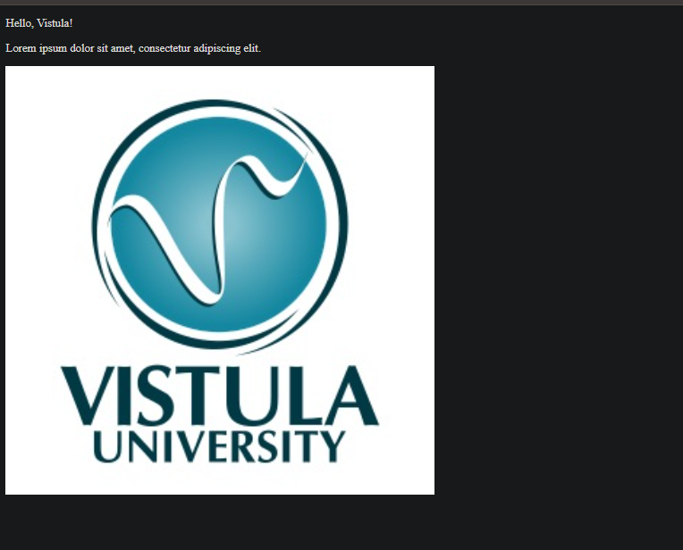

# Task 1 – Spring Boot Application

## Description
This project is a simple Spring Boot application created as Task 1 for the Spring Framework course.  
The application demonstrates how to create a controller, handle HTTP requests, and return both text and HTML views using Thymeleaf.

---

## Technologies
- Java 21
- Spring Boot
- Spring Web
- Thymeleaf
- Maven
- IntelliJ IDEA

---

## How to Run
1. Open the project in IntelliJ IDEA  
2. Run the main application class  
3. The application starts on port 8080

---

## Endpoint

### GET `/greeting`

http://localhost:8080/greeting
*(Screenshot showing the list of all endpoints in the browser)*

